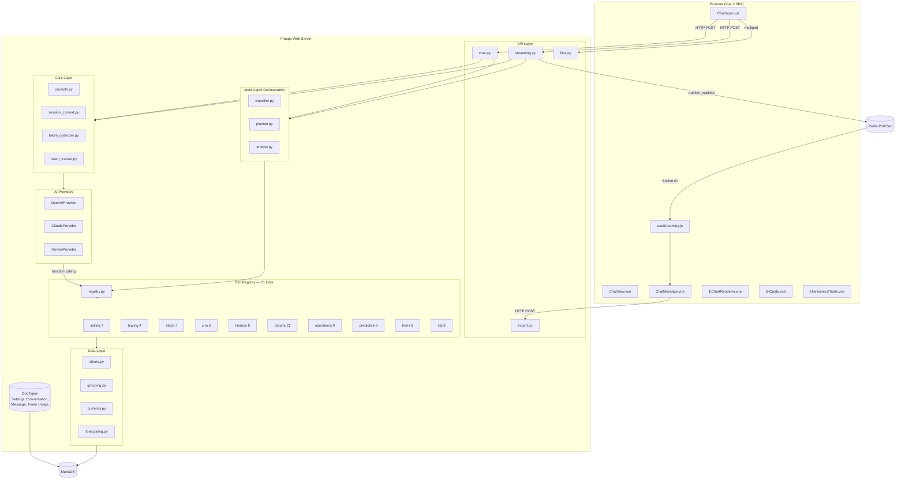
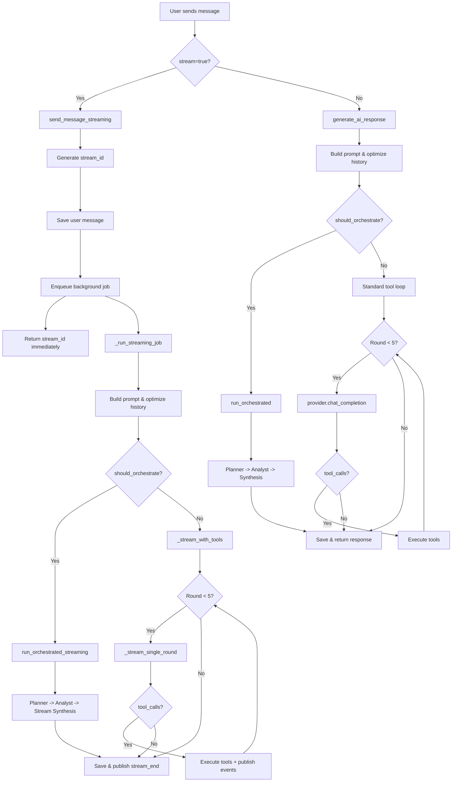
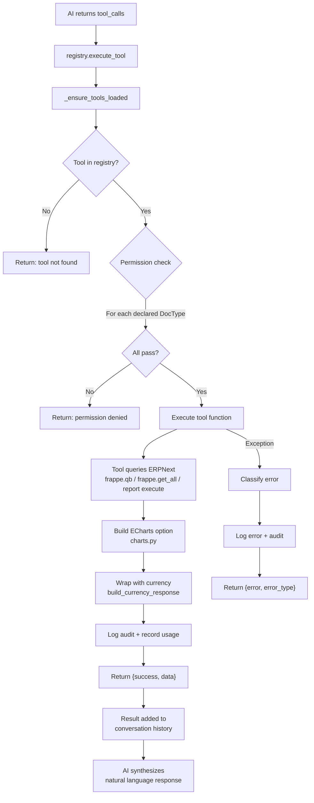
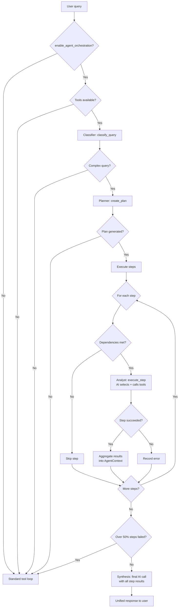
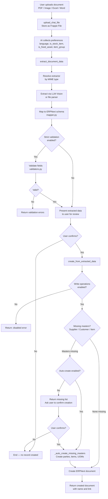

# AI Chatbot for Frappe/ERPNext -- Project Overview (v01)

**Publisher:** Sanjay Kumar
**License:** MIT
**Framework:** Python backend on Frappe Framework, Vue 3 frontend (Vite + Tailwind CSS)
**AI Providers:** OpenAI (GPT-4o, GPT-4-Turbo, GPT-3.5-Turbo), Anthropic Claude (Opus 4.5, Sonnet 4.5, Haiku 4.5), Google Gemini (2.5 Flash, 2.5 Pro)
**Charts:** Apache ECharts
**Business Intelligence Tools:** 71

---

## Table of Contents

1. [Project Summary](#1-project-summary)
2. [Architecture](#2-architecture)
3. [AI Provider Integration](#3-ai-provider-integration)
4. [Tool System](#4-tool-system)
5. [Data Layer](#5-data-layer)
6. [Frontend Architecture](#6-frontend-architecture)
7. [Mention System](#7-mention-system)
8. [Streaming](#8-streaming)
9. [Multi-Agent Orchestration](#9-multi-agent-orchestration)
10. [Intelligent Document Processing (IDP)](#10-intelligent-document-processing-idp)
11. [Predictive Analytics](#11-predictive-analytics)
12. [Multi-Company and Multi-Currency](#12-multi-company-and-multi-currency)
13. [Security](#13-security)
14. [Configuration](#14-configuration)
15. [Automation](#15-automation)
16. [PDF Export](#16-pdf-export)
17. [Token Management](#17-token-management)
18. [Plugin System](#18-plugin-system)
19. [Future Roadmap](#19-future-roadmap)

---

## 1. Project Summary

AI Chatbot is a Frappe framework application that provides a modern, real-time chat interface powered by large language models (OpenAI, Claude, Gemini) with deep integration into ERPNext business data. It allows users to query, analyze, and manipulate their ERP data through natural language conversation.

The application ships 71 business intelligence tools spanning sales, purchasing, inventory, finance, CRM, HRMS, and predictive analytics. Tools query ERPNext data via Frappe's ORM (frappe.qb and frappe.get_all) or by calling ERPNext's standard report `execute()` functions directly, generate ECharts visualizations, and return structured results that the AI synthesizes into natural language responses.

Key capabilities:

- Natural language querying of ERPNext business data across all major modules
- Real-time token-by-token streaming via Frappe Realtime (Socket.IO)
- Multi-company consolidation with subsidiary aggregation and currency conversion
- Multi-dimensional grouping engine (7 built-in dimensions + dynamic accounting dimensions)
- ECharts-based interactive visualizations (bar, line, pie, stacked bar, horizontal bar, forecast)
- Intelligent Document Processing (IDP) -- extract data from PDFs, images, Excel, Word and create ERPNext records
- Predictive analytics -- sales/demand/cash flow forecasting with confidence intervals, anomaly detection
- Multi-agent orchestration for complex queries (planner-analyst-synthesis pipeline)
- CRUD operations on ERPNext records with confirmation workflow
- Scheduled report automation with email/PDF delivery
- PDF export of individual messages and full conversations
- Dark mode support synchronized with Frappe desk theme
- File upload with Vision API support for images
- @mention autocomplete for company, period, cost center, department, warehouse, customer, item, and accounting dimensions

---

## 2. Architecture

### 2.1 Directory Structure

```
ai_chatbot/                          # Python package (Frappe app backend)
|
+-- api/                             # HTTP API endpoints
|   +-- chat.py                      # Core chat API (@frappe.whitelist)
|   +-- streaming.py                 # Streaming API (Frappe Realtime)
|   +-- files.py                     # File upload API
|   +-- export.py                    # PDF export API
|
+-- core/                            # Core infrastructure
|   +-- config.py                    # Settings reader, company resolver
|   +-- prompts.py                   # Dynamic system prompt builder
|   +-- session_context.py           # Per-conversation session state
|   +-- token_tracker.py             # Token usage recording
|   +-- token_optimizer.py           # History trimming, tool result compression
|   +-- consolidation.py             # Multi-company consolidation
|   +-- dimensions.py                # Accounting dimension helpers
|   +-- constants.py                 # App-wide constants
|   +-- exceptions.py                # Custom exception classes
|   +-- logger.py                    # Structured logging
|   +-- ai_utils.py                  # Provider response parsing
|
+-- utils/
|   +-- ai_providers.py              # OpenAI, Claude, Gemini provider classes
|
+-- tools/                           # Business intelligence tools
|   +-- registry.py                  # Decorator-based tool registration
|   +-- base.py                      # Backward-compatible BaseTool wrapper
|   +-- common.py                    # Shared helpers (primary, etc.)
|   +-- selling.py                   # Sales analytics (5 tools)
|   +-- buying.py                    # Purchase analytics (2 tools)
|   +-- stock.py                     # Inventory management (4 tools)
|   +-- crm.py                       # CRM analytics (5 tools)
|   +-- hrms.py                      # HRMS tools (6 tools)
|   +-- session.py                   # Session management (2 tools)
|   +-- idp.py                       # Document processing (3 tools)
|   +-- finance/                     # Finance sub-modules (8 custom tools)
|   |   +-- analytics.py             #   Multi-dimensional summary
|   |   +-- cash_flow.py             #   Payment Entry cash flow, bank balance
|   |   +-- cfo.py                   #   CFO dashboard, financial overview, monthly comparison
|   |   +-- gl_analytics.py          #   GL summary with flexible grouping
|   |   +-- profitability.py         #   Profitability by customer/item/territory
|   +-- reports/                     # ERPNext standard report wrappers (21 tools)
|   |   +-- _base.py                 #   Report execution utilities
|   |   +-- finance.py               #   14 financial report tools
|   |   +-- sales.py                 #   2 sales register tools
|   |   +-- purchase.py              #   2 purchase register tools
|   |   +-- stock.py                 #   3 stock report tools
|   +-- operations/                  # CRUD operations (9 tools)
|   |   +-- create.py                #   Create lead, opportunity, todo
|   |   +-- update.py                #   Update lead/opportunity status, update todo
|   |   +-- search.py                #   Search documents, customers, items
|   +-- predictive/                  # Predictive analytics (6 tools)
|       +-- sales_forecast.py        #   Revenue forecast, forecast by territory
|       +-- demand_forecast.py       #   Demand forecast
|       +-- cash_flow_forecast.py    #   Cash flow forecast
|       +-- anomaly_detection.py     #   Anomaly detection
|       +-- trends.py                #   Trend analysis (revenue, expenses, demand)
|
+-- ai/                              # Multi-agent orchestration
|   +-- agents/
|       +-- orchestrator.py          # Pipeline coordinator
|       +-- classifier.py            # Query complexity classifier
|       +-- planner.py               # Execution plan generator
|       +-- analyst.py               # Step executor
|       +-- context.py               # AgentContext data class
|       +-- prompts.py               # Agent-specific prompts
|
+-- data/                            # Data abstraction layer
|   +-- analytics.py                 # SUM, GROUP BY, time-series queries
|   +-- grouping.py                  # Multi-dimensional grouping engine
|   +-- charts.py                    # ECharts option builders
|   +-- forecast_charts.py           # Forecast-specific chart builders
|   +-- currency.py                  # Currency conversion, response wrapper
|   +-- operations.py                # CRUD operation helpers
|   +-- queries.py                   # Common query patterns
|   +-- validators.py                # Input validation
|
+-- idp/                             # Intelligent Document Processing
|   +-- extractors/
|   |   +-- base.py                  # Base extractor, file resolver
|   |   +-- pdf_extractor.py         # PDF text/image extraction
|   |   +-- excel_extractor.py       # Excel/CSV extraction
|   |   +-- docx_extractor.py        # Word document extraction
|   +-- mapper.py                    # Extracted data to ERPNext mapping
|   +-- validators.py                # Field validation and matching
|   +-- comparison.py                # Document vs record comparison
|   +-- schema.py                    # DocType schema discovery
|
+-- automation/                      # Scheduled reports
|   +-- scheduled_reports.py         # Cron runner, report executor
|   +-- formatters.py                # HTML/PDF formatters for email/export
|
+-- chatbot/                         # Frappe module (DocTypes)
|   +-- doctype/
|   |   +-- chatbot_settings/        # Configuration (Single DocType)
|   |   +-- chatbot_conversation/    # Conversation records
|   |   +-- chatbot_message/         # Message records
|   |   +-- chatbot_token_usage/     # Token usage tracking
|   |   +-- chatbot_scheduled_report/# Scheduled report definitions
|   |   +-- chatbot_report_recipient/# Child table for report recipients
|   +-- workspace/                   # Frappe workspace definition
|
+-- desktop_icon/                    # Frappe desktop icon config
|
+-- workspace_sidebar/               # Workspace sidebar navigation config
|
+-- public/frontend/                 # Built frontend assets (generated by Vite)
    +-- assets/
        +-- main.js                  # Entry point
        +-- vue-vendor.js            # Vue + Vue Router chunk
        +-- markdown.js              # marked + highlight.js chunk
        +-- icons.js                 # lucide-vue-next chunk
        +-- echarts.js               # Apache ECharts chunk

frontend/                            # Vue 3 SPA source
+-- src/
|   +-- App.vue                      # Root component (theme management)
|   +-- main.js                      # Vue app bootstrap
|   +-- style.css                    # Global styles, markdown, dark mode
|   +-- pages/
|   |   +-- ChatView.vue             # Main chat page
|   +-- components/
|   |   +-- Sidebar.vue              # Conversation list sidebar
|   |   +-- ChatInput.vue            # Message input with @mention
|   |   +-- ChatMessage.vue          # Message renderer (markdown/charts/tables)
|   |   +-- TypingIndicator.vue      # Streaming status indicator
|   |   +-- AgentThinking.vue        # Agent orchestration progress
|   |   +-- HelpModal.vue            # Help/keyboard shortcuts
|   |   +-- charts/
|   |       +-- EChartRenderer.vue   # ECharts rendering component
|   |       +-- ChartMessage.vue     # Chart wrapper in messages
|   |       +-- BiCards.vue           # Business intelligence KPI cards
|   |       +-- HierarchicalTable.vue# Grouped/indented data table
|   +-- composables/
|   |   +-- useStreaming.js           # Streaming state management
|   |   +-- useSocket.js             # Socket.IO connection management
|   |   +-- useFileUpload.js         # File upload state/logic
|   |   +-- useVoiceInput.js         # Voice input (Web Speech API)
|   |   +-- useVoiceOutput.js        # Text-to-speech output
|   +-- utils/
|   |   +-- api.js                   # ChatAPI singleton (CSRF, HTTP)
|   |   +-- markdown.js              # Markdown parsing configuration
|   +-- assets/
|       +-- logo.svg
|       +-- favicon.svg
+-- vite.config.js                   # Build config with manual chunks
+-- tailwind.config.js               # Tailwind CSS configuration
+-- index.html                       # SPA entry HTML
```

### 2.2 High-Level Architecture

```
+-------------------------------------------------------+
|              Browser (Vue 3 SPA)                       |
|  ChatView -> Sidebar, ChatInput, ChatMessage,          |
|              EChartRenderer, BiCards, HierarchicalTable |
+-------------------------+-----------------------------+
                          |
                          | HTTP (REST) / WebSocket (Socket.IO)
                          |
+-------------------------v-----------------------------+
|              Frappe Web Server                         |
|                                                       |
|  +-- API Layer ----------------------------------------+
|  |   api/chat.py          (send_message, CRUD)        |
|  |   api/streaming.py     (send_message_streaming)    |
|  |   api/files.py         (upload_chat_file)          |
|  |   api/export.py        (export_message/conv PDF)   |
|  +----------------------------------------------------+
|  |                                                    |
|  |  +-- Core Layer -----------------------------------+
|  |  |   config.py        (settings, company resolver) |
|  |  |   prompts.py       (dynamic system prompt)      |
|  |  |   session_context.py (per-conversation state)   |
|  |  |   token_tracker.py (usage recording + costing)  |
|  |  |   token_optimizer.py (history trim/compress)    |
|  |  |   consolidation.py (multi-company helpers)      |
|  |  |   dimensions.py    (accounting dim discovery)   |
|  |  +------------------------------------------------+
|  |  |                                                 |
|  |  |  +-- AI Providers (ai_providers.py) -----------+
|  |  |  |   OpenAIProvider   (GPT-4o, etc.)           |
|  |  |  |   ClaudeProvider   (Opus/Sonnet/Haiku 4.5)  |
|  |  |  |   GeminiProvider   (2.5 Flash/Pro)          |
|  |  |  +---------------------------------------------+
|  |  |  |                                              |
|  |  |  |  +-- Tool Registry (registry.py) -----------+
|  |  |  |  |   @register_tool decorator               |
|  |  |  |  |   71 registered tool functions            |
|  |  |  |  |   Category-based enable/disable           |
|  |  |  |  |   DocType permission checks               |
|  |  |  |  |   Plugin hook: ai_chatbot_tool_modules    |
|  |  |  |  |                                           |
|  |  |  |  |   selling (7)    buying (4)    stock (7)  |
|  |  |  |  |   crm (5)        hrms (6)     idp (3)    |
|  |  |  |  |   finance/ (8)   reports/ (21)            |
|  |  |  |  |   operations/ (9) predictive/ (6)         |
|  |  |  |  |   session (2)                              |
|  |  |  |  +------------------------------------------+
|  |  |  |                                              |
|  |  |  |  +-- Data Layer ----------------------------+
|  |  |  |  |   analytics.py  (SUM, GROUP BY, series)  |
|  |  |  |  |   grouping.py   (multi-dim aggregation)  |
|  |  |  |  |   charts.py     (ECharts option builders) |
|  |  |  |  |   currency.py   (conversion, response)   |
|  |  |  |  +------------------------------------------+
|  |  |  |                                              |
|  |  |  |  +-- Multi-Agent (ai/agents/) --------------+
|  |  |  |  |   classifier -> planner -> analyst        |
|  |  |  |  |   -> orchestrator -> synthesis            |
|  |  |  |  +------------------------------------------+
|  |  |  |                                              |
|  |  +--+-- Automation --------------------------------+
|  |     |   scheduled_reports.py (cron every 15 min)   |
|  |     |   formatters.py (HTML/PDF rendering)         |
|  |     +---------------------------------------------+
|  |                                                    |
|  +-- DocTypes ----------------------------------------+
|  |   Chatbot Settings     (Single — configuration)    |
|  |   Chatbot Conversation (per-user conversations)    |
|  |   Chatbot Message      (per-conversation messages) |
|  |   Chatbot Token Usage  (per-request token records) |
|  |   Chatbot Scheduled Report (report definitions)    |
|  |   Chatbot Report Recipient (child table)           |
|  +----------------------------------------------------+
|                                                       |
+-------------------------+-----------------------------+
                          |
                          v
              +---------------------+
              |     MariaDB         |
              | (Frappe database)   |
              +---------------------+
```

### 2.3 Architecture Diagram



### 2.4 Request Flow (Non-Streaming)

```
User types message
       |
       v
ChatInput.vue
       |  @submit
       v
api.js: ChatAPI.sendMessage(conversationId, message)
       |  POST /api/method/ai_chatbot.api.chat.send_message
       v
chat.py: send_message()
       |
       +-- Validate conversation ownership (user == session.user)
       +-- Save user message as Chatbot Message document
       +-- Get conversation history from DB
       +-- Build dynamic system prompt (prompts.py)
       |       Includes: user name, company, currency, fiscal year,
       |       enabled tool categories, session context, IDP rules,
       |       predictive analytics guidelines, write operation rules,
       |       response language, custom persona, format guidelines
       +-- Optimize history (token_optimizer.py)
       |       Trim to max_context_messages, compress tool results
       +-- Get AI provider instance (ai_providers.py)
       +-- Get enabled tool schemas (registry.py)
       +-- Check if multi-agent orchestration applies
       |       classifier.py -> should_orchestrate()
       |       If yes: planner -> analyst -> synthesis pipeline
       |       If no:  standard tool-calling loop
       |
       v
generate_ai_response() -- standard path:
       |
       +-- Loop up to 5 rounds:
       |       |
       |       +-- provider.chat_completion(history, tools)
       |       +-- extract_response() -> content, tool_calls, tokens
       |       |
       |       +-- If no tool_calls: break (final response)
       |       |
       |       +-- For each tool_call:
       |       |       registry.execute_tool(name, arguments)
       |       |       -> tool function queries ERPNext via frappe.qb
       |       |       -> returns {success, data} with echart_option, etc.
       |       |       Add tool result to history
       |       |
       |       +-- Continue loop (AI sees tool results, may call more)
       |
       +-- Track token usage (Chatbot Token Usage document)
       +-- Save assistant message (Chatbot Message document)
       +-- Update conversation metadata (message_count, total_tokens)
       +-- Auto-generate title from first user message if "New Chat"
       |
       v
Return {success: true, message: content, tokens_used: N}
       |
       v
ChatView.vue receives response
       |
       v
ChatMessage.vue renders:
       +-- Markdown (via marked + highlight.js)
       +-- Tables (styled via Tailwind CSS)
       +-- ECharts (from tool_results -> echart_option)
       +-- BiCards (KPI summary cards)
       +-- HierarchicalTable (grouped data with indentation)
```

### 2.5 Decision Flow Diagram



### 2.6 Request Flow (Streaming)

```
User types message
       |
       v
ChatInput.vue
       |  @submit (stream mode)
       v
useStreaming.startListening(conversationId)
       |  Registers Socket.IO event handlers
       v
api.js: ChatAPI.sendMessageStreaming(conversationId, message)
       |  POST /api/method/ai_chatbot.api.chat.send_message (stream=true)
       v
chat.py: send_message() -> delegates to streaming.py
       |
       v
streaming.py: send_message_streaming()
       +-- Validate conversation ownership
       +-- Generate unique stream_id (uuid4[:8])
       +-- Save user message immediately
       +-- Enqueue background job: _run_streaming_job()
       +-- Return {success: true, stream_id: "abc12345"}
           (HTTP response returns immediately)
       |
       v
Background worker: _run_streaming_job()
       |
       +-- frappe.publish_realtime("ai_chat_stream_start", ...)
       +-- Build history, system prompt, optimize
       +-- Check multi-agent orchestration
       |
       +-- _stream_with_tools() -- up to 5 rounds:
       |       |
       |       +-- provider.chat_completion_stream(history, tools)
       |       |       Yields: {type: "token"/"tool_call"/"finish"/"error"}
       |       |
       |       +-- For "token" events:
       |       |       Buffer tokens (20 chars threshold)
       |       |       frappe.publish_realtime("ai_chat_token", {content})
       |       |
       |       +-- For "tool_call" events:
       |       |       frappe.publish_realtime("ai_chat_tool_call", ...)
       |       |       Execute tool: BaseTool.execute_tool(name, args)
       |       |       frappe.publish_realtime("ai_chat_tool_result", ...)
       |       |       Add result to history, continue streaming
       |       |
       |       +-- For "finish" events:
       |               Flush remaining buffer
       |
       +-- Save assistant message to DB
       +-- Track token usage
       +-- frappe.publish_realtime("ai_chat_stream_end", {content})

                                        Socket.IO
                                           |
                        +------------------+------------------+
                        |                                     |
                        v                                     v
Frontend: useStreaming composable              Frappe Realtime
       |  Listens for events:                 (Redis Pub/Sub)
       |    ai_chat_stream_start
       |    ai_chat_token          -> streamingContent.value += token
       |    ai_chat_tool_call      -> toolCalls.value.push(...)
       |    ai_chat_tool_result    -> update tool status
       |    ai_chat_process_step   -> processStep.value = step
       |    ai_chat_stream_end     -> isStreaming = false
       |    ai_chat_error          -> streamError.value = error
       |    ai_chat_agent_plan     -> agentPlan.value = [...]
       |    ai_chat_agent_step_*   -> update step status
       |
       v
ChatMessage.vue renders progressively:
       +-- Markdown rendered in real-time as tokens arrive
       +-- Blinking cursor shown during streaming
       +-- Tool call indicators shown during execution
       +-- Agent plan progress displayed for orchestrated queries
```

### 2.7 Tool Execution Flow



### 2.7.1 Tool Execution Flow (Detail)

```
AI response contains tool_calls
       |
       v
registry.execute_tool(tool_name, arguments)
       |
       +-- _ensure_tools_loaded()
       |       Lazily imports all tool modules (conditional on ERPNext/HRMS)
       |       Loads external plugin modules via hooks
       |
       +-- Lookup tool in _TOOL_REGISTRY
       |       If not found: return {success: false, error: "not found"}
       |
       +-- Permission check on declared doctypes
       |       For each doctype in tool_info["doctypes"]:
       |           frappe.has_permission(dt, "read", user=session.user)
       |       If any fail: return {success: false, error: "no permission"}
       |
       +-- Execute: tool_info["function"](**arguments)
       |       Tool queries ERPNext:
       |         - frappe.qb (Query Builder) for aggregations
       |         - frappe.get_all for list queries
       |         - data/analytics.py helpers (get_sum, get_grouped_sum, get_time_series)
       |         - data/grouping.py for multi-dimensional analysis
       |         - ERPNext report execute() functions (report_* tools)
       |       Tool builds ECharts options:
       |         - data/charts.py (build_bar_chart, build_line_chart, etc.)
       |       Tool wraps response:
       |         - data/currency.py: build_currency_response(result, company)
       |           Adds: company, company_label, currency fields
       |
       +-- Return {success: true, data: <tool result dict>}
       |
       v
Result returned to AI as tool message in conversation history
       |
       v
AI synthesizes natural language response from tool data
```

### 2.8 Multi-Company Flow

```
User query mentioning "consolidated" or "group-wide"
       |
       v
AI auto-calls: set_include_subsidiaries(true)
       |
       v
session_context.py: set_session_context(conversation_id, "include_subsidiaries", True)
       |  Stored as JSON in Chatbot Conversation.session_context
       v
Next tool call (e.g., get_sales_analytics):
       |
       +-- get_company_filter(company)
       |       Reads frappe.flags.current_conversation_id
       |       Calls get_companies_for_query(company, conversation_id)
       |       If include_subsidiaries is True and company is parent:
       |           Returns [parent, child1, child2, ...]
       |       Else:
       |           Returns company (single string)
       |
       +-- Tool uses company filter in query:
       |       If list: query.where(table.company.isin(companies))
       |       If str:  query.where(table.company == company)
       |
       +-- build_currency_response(result, company)
       |       Adds company, company_label (with "including its subsidiaries"), currency
       |       Checks session for target_currency override
       |
       v
AI receives aggregated data across parent + subsidiaries
AI presents with company_label and currency from response
```

---

## 3. AI Provider Integration

### 3.1 Provider Abstraction

The file `ai_chatbot/utils/ai_providers.py` defines a unified provider abstraction:

```
AIProvider (base class)
  +-- chat_completion(messages, tools, stream)      # Non-streaming
  +-- chat_completion_stream(messages, tools)        # Streaming (yields events)
  +-- validate_settings()
      |
      +-- OpenAIProvider    (api.openai.com/v1/chat/completions)
      |
      +-- ClaudeProvider    (api.anthropic.com/v1/messages)
      |
      +-- GeminiProvider    (extends OpenAIProvider, overrides base_url)
          Uses: generativelanguage.googleapis.com/v1beta/openai
```

**Factory function:** `get_ai_provider(provider_name)` reads Chatbot Settings, resolves API key via `get_password()` (encrypted), and returns the appropriate provider instance.

### 3.2 Provider-Specific Details

**OpenAI:**
- Uses the standard `/v1/chat/completions` endpoint
- Tool calling via `tools` parameter with `tool_choice: "auto"`
- Streaming via SSE (`data: [DONE]` sentinel)
- Tool call chunks accumulated by index across stream events

**Claude (Anthropic):**
- Uses the `/v1/messages` endpoint with `anthropic-version: 2023-06-01`
- System prompt sent as top-level `system` field (not in messages array)
- Messages converted from OpenAI format to Claude format:
  - `tool` role messages become `user` messages with `tool_result` content blocks
  - `assistant` messages with `tool_calls` become content blocks with `tool_use` type
  - Multi-modal images converted from OpenAI data URL format to Claude base64 source format
- Streaming via SSE with event types: `content_block_start`, `content_block_delta`, `content_block_stop`, `message_delta`, `message_stop`
- Tool calls tracked per content block (not per chunk index like OpenAI)

**Gemini (Google):**
- Extends `OpenAIProvider` and overrides only `base_url` and default model
- Uses Google's OpenAI-compatible endpoint at `generativelanguage.googleapis.com/v1beta/openai`
- Inherits all OpenAI streaming and tool calling logic

### 3.3 Default Models

| Provider | Default Model                 |
|----------|-------------------------------|
| OpenAI   | gpt-4o                        |
| Claude   | claude-sonnet-4-5-20250929    |
| Gemini   | gemini-2.5-flash              |

### 3.4 Tool Schema Generation

All tools are registered in OpenAI function calling format:

```json
{
  "type": "function",
  "function": {
    "name": "get_sales_analytics",
    "description": "Get sales analytics including revenue, orders, and growth trends",
    "parameters": {
      "type": "object",
      "properties": {
        "from_date": {"type": "string", "description": "Start date (YYYY-MM-DD)"},
        "to_date": {"type": "string", "description": "End date (YYYY-MM-DD)"},
        "company": {"type": "string", "description": "Company name"}
      }
    }
  }
}
```

For Claude, the schema is automatically converted by `_convert_tools_to_claude()` to Claude's `input_schema` format.

### 3.5 Error Classification

API errors are classified into user-friendly messages:

| HTTP Status | Condition              | Message                                          |
|-------------|------------------------|--------------------------------------------------|
| 429         | Rate limit             | "The AI service is temporarily unavailable..."    |
| 429         | Quota exceeded         | "Your AI API quota has been exceeded..."          |
| 400         | Credit/billing issue   | "Your AI API quota has been exceeded..."          |
| 401, 403    | Authentication failure | "Authentication failed... check your API key..."  |
| Other       | -                      | Original error string                            |

### 3.6 Token Tracking

Every AI request records a `Chatbot Token Usage` document with:
- User, conversation, provider, model
- Prompt tokens, completion tokens, total tokens
- Estimated cost in USD (per-model pricing table in `token_tracker.py`)
- Date

Pricing table covers all supported models (e.g., GPT-4o: $2.50/$10.00 per 1M input/output tokens; Claude Sonnet 4.5: $3.00/$15.00).

---

## 4. Tool System

### 4.1 Registration Mechanism

Tools self-register via the `@register_tool` decorator at module import time:

```python
@register_tool(
    name="get_sales_analytics",
    category="selling",
    description="Get sales analytics including revenue, orders, and growth trends",
    parameters={
        "from_date": {"type": "string", "description": "Start date (YYYY-MM-DD)"},
        "to_date": {"type": "string", "description": "End date (YYYY-MM-DD)"},
        "company": {"type": "string", "description": "Company name"},
    },
    doctypes=["Sales Invoice"],
)
def get_sales_analytics(from_date=None, to_date=None, company=None):
    ...
```

Each registration stores: name, category, description, parameters dict, doctypes list, and the function reference in the global `_TOOL_REGISTRY` dict.

### 4.2 Lazy Loading

Tool modules are imported lazily on first access (`_ensure_tools_loaded()`). ERPNext tools are only imported if ERPNext is installed (`is_erpnext_installed()`). HRMS tools are only imported if the HRMS app is installed (`is_hrms_installed()`). External plugin tools are loaded via `frappe.get_hooks("ai_chatbot_tool_modules")`.

### 4.3 Permission and Category Filtering

When building tool schemas for the AI:

1. **Category toggle check:** Each category maps to a Chatbot Settings field (e.g., `selling` -> `enable_sales_tools`). Disabled categories are excluded.
2. **DocType permission check:** For each tool's declared `doctypes`, the user must have `read` permission. Tools the user cannot access are excluded.

### 4.4 Tool Categories and Complete Tool List

**Selling (7 tools) -- category: `selling`, toggle: `enable_sales_tools`**

| Tool Name                      | Description                                      | DocTypes            |
|--------------------------------|--------------------------------------------------|---------------------|
| get_sales_analytics            | Revenue, orders, and growth trends               | Sales Invoice       |
| get_top_customers              | Top customers by revenue                         | Sales Invoice       |
| get_transaction_trend          | Monthly transaction trend (sales/purchase)       | Sales Invoice       |
| get_sales_by_territory         | Sales breakdown by territory/region              | Sales Invoice       |
| get_by_item_group              | Transaction breakdown by item group              | Sales Invoice       |
| report_sales_register          | ERPNext Sales Register with tax details          | Sales Invoice       |
| report_item_wise_sales_register| ERPNext Item-wise Sales Register                 | Sales Invoice       |

**Buying (4 tools) -- category: `buying`, toggle: `enable_purchase_tools`**

| Tool Name                          | Description                                  | DocTypes            |
|------------------------------------|----------------------------------------------|---------------------|
| get_purchase_analytics             | Purchase analytics and spending              | Purchase Invoice    |
| get_supplier_performance           | Supplier performance analysis                | Purchase Invoice    |
| report_purchase_register           | ERPNext Purchase Register with tax details   | Purchase Invoice    |
| report_item_wise_purchase_register | ERPNext Item-wise Purchase Register          | Purchase Invoice    |

**Inventory (7 tools) -- category: `inventory`, toggle: `enable_inventory_tools`**

| Tool Name                | Description                                      | DocTypes            |
|--------------------------|--------------------------------------------------|---------------------|
| get_inventory_summary    | Warehouse stock summary                          | Bin                 |
| get_low_stock_items      | Items below reorder level                        | Bin                 |
| get_stock_movement       | Stock ledger movement analysis                   | Stock Ledger Entry  |
| get_stock_ageing         | Inventory ageing analysis                        | Stock Ledger Entry  |
| report_stock_ledger      | ERPNext Stock Ledger (all stock movements)       | Stock Ledger Entry  |
| report_stock_balance     | ERPNext Stock Balance (current snapshot)          | Stock Ledger Entry  |
| report_stock_ageing      | ERPNext Stock Ageing (slow-moving items)         | Stock Ledger Entry  |

**Finance — Custom Analytics (8 tools) -- category: `finance`, toggle: `enable_finance_tools`**

| Tool Name                     | Sub-module       | Description                                     |
|-------------------------------|------------------|-------------------------------------------------|
| get_financial_overview        | cfo.py           | Financial overview with KPIs (from P&L/BS/AR/AP reports) |
| get_cfo_dashboard             | cfo.py           | CFO-level executive dashboard with BI cards     |
| get_monthly_comparison        | cfo.py           | Month-over-month financial comparison           |

**FinancialReportEngine (FRE) Consistency (Phase 19):** When "Use Financial Report Engine" is enabled in Chatbot Settings, the CFO dashboard tools (`_pnl_totals`, `_balance_sheet_totals`, `get_monthly_comparison`) route through ERPNext's template path and extract KPIs from report data rows. A dual-path fallback chain ensures data is always returned: FRE template path -> standard `report_summary` path -> data row extraction. Helper functions for FRE support are in `tools/reports/_base.py` (`is_fre_enabled()`, `extract_kpis_from_report_data()`, `_row_value()`).
| get_cash_flow                 | cash_flow.py     | Payment Entry-based cash flow analysis/trend     |
| get_bank_balance              | cash_flow.py     | Current bank/cash balances from GL               |
| get_gl_summary                | gl_analytics.py  | GL summary with flexible grouping                |
| get_profitability             | profitability.py | Profitability by customer/item/territory         |
| get_multidimensional_summary  | analytics.py     | Multi-dimensional grouped aggregation            |

**Finance — ERPNext Standard Reports (14 tools) -- category: `finance`, toggle: `enable_finance_tools`**

These tools are thin wrappers around ERPNext's standard report `execute()` functions (Phase 12B), sourcing data directly from ERPNext reports for consistency with the numbers shown in the ERPNext UI.

| Tool Name                                | Sub-module   | Description                                    |
|------------------------------------------|--------------|------------------------------------------------|
| report_general_ledger                    | finance.py   | General Ledger with all GL Entry details       |
| report_accounts_receivable               | finance.py   | Invoice-wise AR with aging (0-30, 31-60, 61-90, 90+) |
| report_accounts_receivable_summary       | finance.py   | AR summary per customer with aging buckets     |
| report_accounts_payable                  | finance.py   | Invoice-wise AP with aging                     |
| report_accounts_payable_summary          | finance.py   | AP summary per supplier with aging buckets     |
| report_trial_balance                     | finance.py   | Account balances: opening/debit/credit/closing |
| report_profit_and_loss                   | finance.py   | P&L statement with periodic breakdown          |
| report_balance_sheet                     | finance.py   | Assets, liabilities, equity at point in time   |
| report_cash_flow                         | finance.py   | GL-based cash flow (operating/investing/financing) |
| report_consolidated_financial_statement  | finance.py   | Consolidated P&L/BS/CF for group companies     |
| report_consolidated_trial_balance        | finance.py   | Consolidated trial balance across companies    |
| report_account_balance                   | finance.py   | Group account balances on a date               |
| report_financial_ratios                  | finance.py   | Liquidity, solvency, and turnover ratios       |
| report_budget_variance                   | finance.py   | Budget vs actual by cost center/dept/project   |

**CRM (5 tools) -- category: `crm`, toggle: `enable_crm_tools`**

| Tool Name                | Description                                      | DocTypes            |
|--------------------------|--------------------------------------------------|---------------------|
| get_lead_statistics      | Lead count, status breakdown, conversion metrics  | Lead                |
| get_opportunity_analytics| Opportunity pipeline with stages and values       | Opportunity         |
| get_lead_conversion_rate | Lead to opportunity conversion rate              | Lead                |
| get_lead_source_analysis | Lead analysis by source/campaign                 | Lead                |
| get_sales_funnel         | Sales funnel from leads to orders                | Lead, Opportunity, Sales Order |

**HRMS (6 tools) -- category: `hrms`, toggle: `enable_hrms_tools`**

| Tool Name                | Description                                      | DocTypes            |
|--------------------------|--------------------------------------------------|---------------------|
| get_employee_count       | Employee count by department, status, gender      | Employee            |
| get_attendance_summary   | Attendance summary for a period                  | Attendance          |
| get_leave_balance        | Leave balance for employees                      | Leave Allocation    |
| get_payroll_summary      | Payroll summary with department breakdown        | Salary Slip         |
| get_department_wise_salary| Department-wise salary analysis                 | Salary Slip         |
| get_employee_turnover    | Employee turnover/attrition analysis             | Employee            |

**Operations (9 tools) -- category: `operations`, toggle: `enable_write_operations`**

| Tool Name                | Description                                      | DocTypes            |
|--------------------------|--------------------------------------------------|---------------------|
| create_lead              | Create a new CRM Lead                            | Lead                |
| create_opportunity       | Create a new CRM Opportunity                     | Opportunity         |
| create_todo              | Create a new ToDo task                           | ToDo                |
| update_lead_status       | Update Lead status                               | Lead                |
| update_opportunity_status| Update Opportunity status                        | Opportunity         |
| update_todo              | Update ToDo fields                               | ToDo                |
| search_documents         | Search across ERPNext documents                  | (various)           |
| search_customers         | Search customers by name/group/territory         | Customer            |
| search_items             | Search items by name/group/code                  | Item                |

**IDP (3 tools) -- category: `idp`, toggle: `enable_idp_tools`**

| Tool Name                     | Description                                 | DocTypes            |
|-------------------------------|---------------------------------------------|---------------------|
| extract_document_data         | Extract structured data from uploaded files  | (none)              |
| create_from_extracted_data    | Create ERPNext records from extracted data   | (various)           |
| compare_document_with_record  | Compare uploaded document vs ERPNext record  | (various)           |

**Predictive (6 tools) -- category: `predictive`, toggle: `enable_predictive_tools`**

| Tool Name                | Description                                      | DocTypes            |
|--------------------------|--------------------------------------------------|---------------------|
| analyse_trend            | Trend analysis with regression, growth rates, MA | Sales Invoice, Purchase Invoice |
| forecast_revenue         | Sales revenue forecast with confidence intervals | Sales Invoice       |
| forecast_by_territory    | Revenue forecast broken down by territory        | Sales Invoice       |
| forecast_demand          | Item demand forecast using historical data       | Stock Ledger Entry  |
| forecast_cash_flow       | Cash flow forecast (inflows, outflows, net)      | GL Entry            |
| detect_anomalies         | Statistical anomaly detection in transactions    | (various)           |

**Session (2 tools) -- always enabled (no toggle)**

| Tool Name                | Description                                      |
|--------------------------|--------------------------------------------------|
| set_include_subsidiaries | Toggle subsidiary data inclusion for the session |
| set_target_currency      | Set display currency for the session             |

### 4.5 Multi-Round Tool Calls

The AI can call tools up to 5 rounds per user message (`max_tool_rounds = 5`). In each round:

1. The AI response is parsed for tool calls.
2. Each tool is executed and its result added to the conversation history as a `tool` message.
3. The updated history is sent back to the AI for the next round.
4. If no tool calls are returned, the loop exits with the final text response.

This allows the AI to chain tool calls (e.g., check current company, then query sales data, then compare with budget).

---

## 5. Data Layer

The `ai_chatbot/data/` package provides a clean abstraction between tools and database queries.

### 5.1 Analytics Helpers (`data/analytics.py`)

All queries use `frappe.qb` (Frappe Query Builder based on PyPika) -- never raw SQL with string interpolation.

| Function          | Purpose                                                 |
|-------------------|---------------------------------------------------------|
| `get_sum`         | SUM of a field with company filter                      |
| `get_grouped_sum` | SUM grouped by a field (ORDER BY sum DESC, with limit)  |
| `get_time_series` | Monthly time-series aggregation (last N months)         |

Company filter support: All functions accept `company` as either a single string or a list of strings. When a list is provided, `table.company.isin(companies)` is used.

Filter support: Filters are applied safely via `_apply_filters()` which maps operators (`>=`, `<=`, `between`, `in`, `like`, etc.) to PyPika methods.

### 5.2 Multi-Dimensional Grouping Engine (`data/grouping.py`)

The grouping engine supports hierarchical data aggregation across multiple dimensions and time periods.

**Supported metrics:** revenue, expenses, profit (computed: revenue - expenses), orders

**Built-in dimensions (7):**
- company, territory, customer_group, customer, item_group, cost_center, department

**Dynamic accounting dimensions:** Automatically discovered via ERPNext's `Accounting Dimension` DocType. Supports any custom dimension configured in ERPNext (e.g., business_vertical, project, region).

**Period types:** monthly, quarterly, yearly

**Dimension name resolution:** The engine resolves user-provided dimension names via multiple strategies:
- Exact match
- Space to underscore normalization
- Case-insensitive matching
- Label matching
- Suffix/partial matching (e.g., "vertical" resolves to "business_vertical")

**Output format:** Hierarchical rows with `description`, `level`, `is_group`, and `values` (array: [grand_total, period_1, period_2, ...]).

**Key function:** `get_grouped_metric(metric, group_by, period, from_date, to_date, company)` -- accepts up to 3 dimensions.

### 5.3 ECharts Option Builders (`data/charts.py`)

Backend functions that construct complete ECharts option dicts. The frontend passes these directly to `echarts.setOption()`.

| Builder                       | Chart Type         |
|-------------------------------|--------------------|
| `build_bar_chart`             | Vertical bar       |
| `build_line_chart`            | Line (with area)   |
| `build_pie_chart`             | Donut/pie          |
| `build_multi_series_chart`    | Multi-series line/bar |
| `build_stacked_bar_chart`     | Stacked bar        |
| `build_horizontal_bar`        | Horizontal bar     |

Additional builders in `data/forecast_charts.py`:

| Builder                          | Chart Type                       |
|----------------------------------|----------------------------------|
| `build_forecast_chart`           | Forecast line with confidence band |
| `build_trend_analysis_chart`     | Actual + regression + MA overlays |
| `build_cash_flow_forecast_chart` | Multi-series inflow/outflow forecast |

All charts use a consistent 10-color palette defined in `CHART_COLORS`.

### 5.4 Currency Response Wrapper (`data/currency.py`)

Every monetary tool response calls `build_currency_response(result, company)` which adds:
- `company`: The company name
- `company_label`: Company name with subsidiary notation (e.g., "Acme Corp including its subsidiaries")
- `currency`: The company's default currency (or session-level `target_currency` if set)

Additional utilities: `get_exchange_rate()`, `convert_to_company_currency()`, `format_currency()`.

---

## 6. Frontend Architecture

### 6.1 Technology Stack

- **Vue 3** with Composition API (`<script setup>`)
- **Vite** build tool with manual chunk splitting
- **Tailwind CSS** for styling with dark mode support (`dark:` prefix)
- **marked** + **highlight.js** for markdown rendering with syntax highlighting
- **Apache ECharts** for all chart/visualization rendering
- **lucide-vue-next** for icons
- **Vue Router** for SPA routing

### 6.2 Component Hierarchy

```
App.vue (theme management: light/dark, syncs with Frappe desk_theme)
  |
  +-- ChatView.vue (main page, full layout)
        |
        +-- Sidebar.vue
        |     Conversation list, search, new chat button
        |     Conversation CRUD (create, delete, rename)
        |
        +-- ChatHeader (inline in ChatView)
        |     Current conversation title, actions menu
        |     Language selector, PDF export buttons
        |
        +-- ChatMessage.vue (for each message in the conversation)
        |     |
        |     +-- Markdown rendering (via marked)
        |     +-- EChartRenderer.vue (when tool_results contain echart_option)
        |     +-- BiCards.vue (when tool_results contain bi_cards)
        |     +-- HierarchicalTable.vue (when tool_results contain hierarchical_table)
        |     +-- ChartMessage.vue (chart wrapper with expand/collapse)
        |     +-- Code block syntax highlighting (highlight.js)
        |     +-- Copy button, PDF export button per message
        |
        +-- ChatInput.vue
        |     Text input with auto-resize
        |     @mention autocomplete dropdown (8 categories)
        |     File upload button (images, PDFs, Excel, Word, CSV)
        |     Voice input button (Web Speech API)
        |     Send button with streaming toggle
        |
        +-- TypingIndicator.vue
        |     Shown during streaming: process step text, blinking dots
        |
        +-- AgentThinking.vue
        |     Shown during multi-agent orchestration
        |     Displays plan steps with progress indicators
        |
        +-- HelpModal.vue
              Keyboard shortcuts and feature documentation
```

### 6.3 State Management

The application uses Vue 3 reactivity primitives directly (no Vuex/Pinia):

- `ref()` for mutable reactive state
- `computed()` for derived state
- `readonly()` for exposing immutable state from composables

State is scoped to components and composables. Cross-component communication uses props, events, and the composable pattern.

### 6.4 API Client (`utils/api.js`)

The `ChatAPI` class is exported as a singleton (`chatAPI`). It handles:

- CSRF token initialization (from `window.csrf_token` or cookie)
- All HTTP requests as POST to `/api/method/ai_chatbot.api.chat.<endpoint>`
- File upload via multipart/form-data to `/api/method/ai_chatbot.api.files.<endpoint>`
- PDF export via `/api/method/ai_chatbot.api.export.<endpoint>`
- Session cookie inclusion (`credentials: 'include'`)

### 6.5 Build Configuration (`vite.config.js`)

- Output directory: `../ai_chatbot/public/frontend`
- Manual chunks for code splitting:
  - `vue-vendor`: vue, vue-router
  - `markdown`: marked, highlight.js
  - `icons`: lucide-vue-next
  - `echarts`: echarts
- Chunk size warning limit: 1200 KB
- Path alias: `@` -> `./src`

### 6.6 Dark Mode

Dark mode is synchronized with Frappe's desk theme:

1. On mount, reads `data-theme` and `data-theme-mode` attributes from `<html>`.
2. For `automatic` mode, defers to OS preference via `window.matchMedia('(prefers-color-scheme: dark)')`.
3. Observes attribute changes via `MutationObserver`.
4. Re-syncs when the browser tab becomes visible (catches theme changes in other Frappe tabs).
5. Tailwind's `dark:` classes handle all CSS switching.

---

## 7. Mention System

The @mention system allows users to inject structured context into their queries.

### 7.1 Categories

| Category              | Source DocType         | Behavior                           |
|-----------------------|------------------------|------------------------------------|
| `company`             | Company                | Lists all companies, default first |
| `period`              | (computed)             | Fiscal year-aware date presets     |
| `cost_center`         | Cost Center            | Filtered by company                |
| `department`          | Department             | Filtered by company                |
| `warehouse`           | Warehouse              | Filtered by company                |
| `customer`            | Customer               | All customers (searchable)         |
| `item`                | Item                   | All items (searchable)             |
| `accounting_dimension`| Accounting Dimension   | Dynamic dimensions with values     |

### 7.2 Frontend Flow

1. User types `@` in ChatInput.vue
2. A dropdown appears showing the 8 mention categories
3. User selects a category (or continues typing to filter)
4. `api.js: chatAPI.getMentionValues(mentionType, searchTerm, company)` is called
5. Backend returns values from the relevant ERPNext DocType
6. User selects a value; it is inserted into the message text as `@Category:Value`
7. The AI receives the mention as part of the message text and uses it for context

### 7.3 Period Presets

Period presets are dynamically computed based on the company's fiscal year:
- This Week, This Month, Last Month (always available)
- This Quarter, This FY, Last FY (available when ERPNext fiscal year is configured)

---

## 8. Streaming

### 8.1 Architecture

Streaming uses Frappe's built-in Realtime system:

```
Background Worker -> frappe.publish_realtime() -> Redis Pub/Sub -> Socket.IO -> Browser
```

The streaming endpoint (`send_message_streaming`) enqueues a background job (`_run_streaming_job`) and returns immediately with a `stream_id`. The background job streams tokens via `frappe.publish_realtime()`.

### 8.2 Realtime Events

| Event Name              | Payload                                    | Direction        |
|-------------------------|--------------------------------------------|------------------|
| `ai_chat_stream_start`  | `{conversation_id, stream_id}`             | Server -> Client |
| `ai_chat_token`         | `{conversation_id, stream_id, content}`    | Server -> Client |
| `ai_chat_tool_call`     | `{conversation_id, stream_id, tool_name, tool_arguments}` | Server -> Client |
| `ai_chat_tool_result`   | `{conversation_id, stream_id, tool_name, result}` | Server -> Client |
| `ai_chat_process_step`  | `{conversation_id, stream_id, step}`       | Server -> Client |
| `ai_chat_stream_end`    | `{conversation_id, stream_id, content, tokens_used, tool_calls}` | Server -> Client |
| `ai_chat_error`         | `{conversation_id, stream_id, error}`      | Server -> Client |
| `ai_chat_agent_plan`    | `{conversation_id, stream_id, plan}`       | Server -> Client |
| `ai_chat_agent_step_start` | `{conversation_id, stream_id, step_id, description}` | Server -> Client |
| `ai_chat_agent_step_result` | `{conversation_id, stream_id, step_id, status, summary}` | Server -> Client |

### 8.3 Token Buffering

Tokens are buffered on the server side (`TOKEN_BUFFER_SIZE = 20` characters) to reduce Redis Pub/Sub overhead. The buffer is flushed when it reaches the threshold or when the stream finishes.

### 8.4 Frontend Composable (`useStreaming.js`)

The `useStreaming()` composable provides reactive state:

| State Property     | Type              | Description                                |
|--------------------|-------------------|--------------------------------------------|
| `streamingContent` | `ref<string>`     | Accumulated text (readonly)                |
| `isStreaming`      | `ref<boolean>`    | Whether streaming is active (readonly)     |
| `currentStreamId`  | `ref<string>`     | Active stream ID (readonly)                |
| `toolCalls`        | `ref<array>`      | Tool call progress (readonly)              |
| `streamError`      | `ref<string>`     | Error message if any (readonly)            |
| `processStep`      | `ref<string>`     | Current process step label (readonly)      |
| `agentPlan`        | `ref<array>`      | Agent orchestration plan steps (readonly)  |
| `agentCurrentStep` | `ref<string>`     | Currently executing agent step (readonly)  |

Methods: `startListening(conversationId)`, `stopListening()`, `reset()`.

---

## 9. Multi-Agent Orchestration

For complex queries that require multiple data sources, the system uses a multi-agent pipeline.

### 9.1 Pipeline



### 9.1.1 Pipeline (Detail)

```
User query
    |
    v
Classifier (classify_query)
    |  Determines if the query is "complex" (needs multi-step analysis)
    |  Uses the AI provider to classify the query
    v
Planner (create_plan)
    |  Generates an ordered list of execution steps
    |  Each step has: step_id, description, tool_hint, depends_on
    v
Analyst (execute_step / execute_step_streaming)
    |  Executes each step:
    |    - Calls the AI with a focused prompt for this step
    |    - AI selects and calls appropriate tools
    |    - Results are captured in the step object
    |  Steps can depend on previous steps
    |  Failure threshold: if >50% of data steps fail, abort
    v
Orchestrator (run_orchestrated / run_orchestrated_streaming)
    |  Coordinates the pipeline
    |  Checks dependencies between steps
    |  Aggregates results into AgentContext
    v
Synthesis
    |  Final AI call with all step results
    |  Produces the unified natural language response
    |  (Streamed token-by-token in streaming mode)
    v
Final response to user
```

### 9.2 AgentContext

The `AgentContext` data class holds:
- `query`: The original user question
- `plan`: List of `PlanStep` objects
- `all_tool_calls`: Accumulated tool calls from all steps
- `all_tool_results`: Accumulated tool results
- `total_tokens`: Running token count
- `errors`: List of error messages

### 9.3 Settings Toggle

Multi-agent orchestration is controlled by the `enable_agent_orchestration` field in Chatbot Settings. When disabled, all queries use the standard single-pass tool-calling loop.

---

## 10. Intelligent Document Processing (IDP)

### 10.1 Overview

The IDP subsystem extracts structured data from uploaded documents and creates ERPNext records from the extracted data.

### 10.2 Supported Formats

| Format | Extractor              | Method                          |
|--------|------------------------|---------------------------------|
| PDF    | `pdf_extractor.py`     | Text extraction + LLM Vision    |
| Images | (LLM Vision directly)  | Base64 encoded, sent to AI      |
| Excel  | `excel_extractor.py`   | Cell-by-cell parsing            |
| CSV    | `excel_extractor.py`   | Parsed as tabular data          |
| Word   | `docx_extractor.py`    | Paragraph and table extraction  |

### 10.3 IDP Pipeline Diagram



### 10.4 Workflow

1. User uploads a document (via ChatInput file upload).
2. AI collects user preferences: output language, is_stock_item, is_fixed_asset, item_group.
3. `extract_document_data` tool is called with `file_url` and `target_doctype`.
4. Extracted data is presented to the user for review.
5. User confirms; `create_from_extracted_data` is called.
6. If master records are missing (e.g., new suppliers, items), the tool reports them and the user is asked whether to create them.
7. On confirmation, `create_from_extracted_data` is called again with `create_missing_masters='true'` and `item_defaults_json`.

### 10.5 Document Comparison

The `compare_document_with_record` tool compares an uploaded document against an existing ERPNext record, identifying discrepancies in quantities, amounts, dates, and other fields.

---

## 11. Predictive Analytics

### 11.1 Forecasting Tools

| Tool               | What It Forecasts              | Historical Source   |
|--------------------|--------------------------------|---------------------|
| `forecast_revenue` | Monthly sales revenue          | Sales Invoice       |
| `forecast_by_territory` | Revenue by territory       | Sales Invoice       |
| `forecast_demand`  | Item demand (quantities)       | Stock Ledger Entry  |
| `forecast_cash_flow` | Cash inflows, outflows, net  | GL Entry            |

### 11.2 Trend Analysis Tool

The `analyse_trend` tool provides retrospective trend analysis (as opposed to forward-looking forecasts):

| Parameter  | Description |
|------------|-------------|
| `metric`   | "revenue" (Sales Invoice totals), "expenses" (Purchase Invoice totals), or "demand" (item quantity, requires `item_code`) |
| `months`   | History length: 3-36 months (default 12) |
| `item_code`| Required for demand metric |
| `company`  | Optional, defaults to user's company |

Returns: trend direction (increasing/decreasing/stable), slope per period, R-squared, total change %, average growth %, first-half vs second-half comparison, seasonality detection, moving averages (3 and 6 period), and an ECharts chart with linear regression trend line overlay.

### 11.3 Methods

The statistical forecasting engine (`data/forecasting.py`) supports:
- Simple Moving Average (SMA)
- Exponential Moving Average (EMA)
- Holt's Double Exponential Smoothing (level + trend)
- Holt-Winters Triple Exponential Smoothing (level + trend + seasonality)
- Linear regression (with pure-Python fallback when numpy is unavailable)
- Seasonal decomposition (multiplicative)

The engine auto-selects the method based on data characteristics:
- **Holt-Winters** when 12+ months of data with detectable seasonality
- **Holt's method** when trend is present but data is insufficient for seasonality
- **EMA** as the default fallback

Results include:
- Point forecasts for each future period
- 80% and 95% confidence intervals
- Detected trends and seasonality
- Historical data for comparison

**Minimum data requirement:** 3 months of historical data (`MIN_FORECAST_HISTORY`).
**Maximum forecast horizon:** 12 months (`MAX_FORECAST_MONTHS`).

### 11.4 Anomaly Detection

The `detect_anomalies` tool identifies unusual transactions using:
- Z-score method (statistical standard deviations)
- IQR (Interquartile Range) method

Flagged anomalies include context: amount, date, party, and reason for flagging.

---

## 12. Multi-Company and Multi-Currency

### 12.1 Design Principles

- Every tool that queries transactional data accepts a `company` parameter, defaulting to `frappe.defaults.get_user_default("Company")`.
- Monetary aggregations always use `base_*` fields (e.g., `base_grand_total`, `base_paid_amount`) to ensure amounts are in the company's base currency.
- Tool responses always include `company`, `company_label`, and `currency` fields via `build_currency_response()`.

### 12.2 Company Name Resolution

The AI may provide approximate company names (e.g., "Tara Technologies" instead of "Tara Technologies (Demo)"). The `_resolve_company_name()` function in `config.py` handles this:

1. Exact match (fast path)
2. Fuzzy match: `LIKE %name%`
3. Multiple matches: prefer shortest name (closest match)
4. No match: return as-is (lets caller handle empty results)

### 12.3 Session-Level Multi-Company

Session context is stored as JSON in `Chatbot Conversation.session_context`:

| Key                    | Type   | Default | Description                                |
|------------------------|--------|---------|--------------------------------------------|
| `include_subsidiaries` | bool   | false   | Include child company data in queries      |
| `target_currency`      | string | null    | Override display currency                  |
| `response_language`    | string | null    | Per-conversation language override         |

Session tools: `set_include_subsidiaries(include)` and `set_target_currency(currency)`.

The system prompt instructs the AI to auto-detect consolidation intent from keywords like "consolidated", "group-wide", "all companies".

### 12.4 Consolidation

When `include_subsidiaries` is True:
- `get_company_filter()` returns a list of companies `[parent, child1, child2, ...]`
- Tools use `query.where(table.company.isin(companies))` instead of `== company`
- `build_company_label()` appends "including its subsidiaries" to the company name
- Exchange rates are fetched via ERPNext's `get_exchange_rate()` for cross-currency consolidation

---

## 13. Security

### 13.1 Authentication

- All API endpoints use `@frappe.whitelist()` which requires an authenticated Frappe session.
- Frontend sends session cookies (`credentials: 'include'`) and CSRF token (`X-Frappe-CSRF-Token` header).
- CSRF token is read from `window.csrf_token` or the `csrf_token` cookie.

### 13.2 User Isolation

- Conversations are filtered by `user = frappe.session.user` in all query endpoints.
- Every mutation endpoint (send_message, delete, rename) validates `conversation.user == frappe.session.user`.
- Streaming jobs pass the user identity to `frappe.publish_realtime()` which targets only that user's Socket.IO connection.

### 13.3 API Key Security

- AI provider API keys are stored in Chatbot Settings using Frappe's `Password` field type, which encrypts values at rest.
- Keys are retrieved at runtime via `settings.get_password("api_key")`.
- Keys are never included in API responses or logged.

### 13.4 Tool Permissions

- Each tool declares the DocTypes it accesses via the `doctypes` parameter.
- Before execution, `execute_tool()` checks `frappe.has_permission(dt, "read", user=session.user)` for each declared DocType.
- Tools the user cannot access are excluded from the schema sent to the AI.

### 13.5 Write Operation Safety

- CRUD operations require `enable_write_operations` to be enabled in settings.
- The system prompt instructs the AI to always confirm with the user before creating or updating records.
- The AI must present details and ask "Shall I proceed?" before executing write tools.

### 13.6 File Upload Restrictions

- Allowed MIME types: images (JPEG, PNG, GIF, WebP), PDF, plain text, CSV, XLSX, DOCX.
- Maximum file size: 10 MB.
- Files are stored as private Frappe File documents linked to the conversation.

---

## 14. Configuration

### 14.1 Chatbot Settings (Single DocType)

The `Chatbot Settings` DocType is the central configuration point.

**API Configuration:**
- `ai_provider`: Select (OpenAI, Claude, Gemini)
- `api_key`: Password (encrypted)
- `model`: Data (model ID string)
- `temperature`: Float (0.0 - 2.0, default 0.7)
- `max_tokens`: Int (default 4000)

**Tool Toggles:**
- `enable_crm_tools`: Check
- `enable_sales_tools`: Check
- `enable_purchase_tools`: Check
- `enable_finance_tools`: Check
- `enable_inventory_tools`: Check
- `enable_hrms_tools`: Check
- `enable_write_operations`: Check
- `enable_idp_tools`: Check
- `enable_predictive_tools`: Check
- `enable_agent_orchestration`: Check

**Query Configuration:**
- `default_query_limit`: Int (default 20)
- `max_query_limit`: Int (default 100)
- `default_top_n_limit`: Int (default 10)
- `max_context_messages`: Int (default 20)

**Prompts:**
- `ai_persona`: Small Text (e.g., "an intelligent ERPNext business assistant")
- `response_language`: Select (English, Hindi, Spanish, French, etc.)
- `custom_system_prompt`: Text
- `custom_instructions`: Text

**Streaming:**
- `enable_streaming`: Check (default enabled)

**Automation:**
- `enable_automation`: Check

### 14.2 Dynamic System Prompt

The system prompt is built dynamically by `core/prompts.py` and includes:

1. AI persona (configurable)
2. Current user context (name, company, currency, fiscal year, today's date)
3. Multi-company context (subsidiaries list, session state)
4. Date range guidelines (do not ask for dates, use fiscal year defaults)
5. Company context guidelines (do not ask for company, use defaults)
6. Currency guidelines (always include currency, use base amounts)
7. Financial analysis behavior (act as CFO when finance tools enabled)
8. Dimension filtering rules
9. Enabled tool categories
10. IDP workflow rules (when IDP enabled)
11. Predictive analytics guidelines (when predictive enabled)
12. Write operation confirmation rules (when operations enabled)
13. Response language (per-conversation or global)
14. Custom system prompt and instructions
15. Response format guidelines (markdown, no image tags)

---

## 15. Automation

### 15.1 Scheduled Reports

The `Chatbot Scheduled Report` DocType allows users to configure automated report generation.

**Fields:**
- `report_name`: Title
- `prompt`: The natural language query to execute
- `company`: Company context
- `schedule`: Select (Daily, Weekly, Monthly, Cron Expression)
- `time_of_day`: Time
- `day_of_week`: Select (for weekly)
- `day_of_month`: Int (for monthly)
- `cron_expression`: Data (for custom cron)
- `enabled`: Check
- `last_run`: Datetime
- `recipients`: Child table (Chatbot Report Recipient) with email addresses

### 15.2 Execution Flow

1. Frappe scheduler calls `run_scheduled_reports()` every 15 minutes (configured in `hooks.py`).
2. The function checks the `enable_automation` master toggle.
3. For each enabled report, `_is_report_due()` checks if it should run based on its schedule and `last_run`.
4. Due reports are enqueued as separate background jobs (`_execute_single_report`).
5. Each report execution:
   - Builds a system prompt with the report's company context
   - Sends the prompt to the AI provider with tools enabled
   - Renders the response as HTML with styled tables and ECharts (as inline SVG for PDF)
   - Generates a PDF via `frappe.utils.pdf.get_pdf()`
   - Sends email with PDF attachment to all configured recipients

---

## 16. PDF Export

### 16.1 Single Message Export

`api/export.py: export_message_pdf(message_name)`:
- Validates ownership
- Renders the message content as HTML with styled tables and charts
- Delegates to `automation/formatters.py` for consistent HTML formatting
- Generates PDF via `frappe.utils.pdf.get_pdf()`
- Saves as a private Frappe File document

### 16.2 Conversation Export

`api/export.py: export_conversation_pdf(conversation_id)`:
- Exports all user and assistant messages
- Renders as a chat transcript with visually distinct user/assistant blocks
- User blocks: gray background, gray left border
- Assistant blocks: white background, blue left border
- Includes timestamps, markdown rendering, and chart SVGs

---

## 17. Token Management

### 17.1 Token Optimization (`core/token_optimizer.py`)

Two strategies to reduce token usage:

1. **History trimming:** Keeps the system prompt + last N messages (configurable via `max_context_messages`, default 20).
2. **Tool result compression:** Removes `echart_option`, `hierarchical_table`, `bi_cards` (frontend-only rendering data). Truncates large data arrays to 20 rows.

Applied via `optimize_history(messages)` before every AI call.

### 17.2 Token Usage Tracking (`core/token_tracker.py`)

Every request creates a `Chatbot Token Usage` document with:
- Provider, model
- Prompt tokens, completion tokens, total tokens
- Estimated cost in USD (per-model pricing lookup)
- User, conversation, date

For streaming, tokens are estimated at ~4 characters per token (since streaming APIs do not always return exact counts).

---

## 18. Plugin System

External Frappe apps can extend the chatbot with custom tools.

### 18.1 Hook Registration

In the external app's `hooks.py`:

```python
ai_chatbot_tool_modules = ["my_app.chatbot_tools.manufacturing"]
```

### 18.2 Plugin Module

The plugin module uses the same `@register_tool` decorator:

```python
from ai_chatbot.tools.registry import register_tool

@register_tool(
    name="get_production_status",
    category="manufacturing",
    description="Get current production order status",
    parameters={...},
    doctypes=["Work Order"],
)
def get_production_status(**kwargs):
    ...
```

### 18.3 Custom Categories

External apps can register new tool categories:

```python
from ai_chatbot.tools.registry import register_tool_category

register_tool_category("manufacturing", settings_field=None)  # Always enabled
# Or with a settings toggle:
register_tool_category("manufacturing", settings_field="enable_manufacturing_tools")
```

---

## 19. Future Roadmap

**Agentic RAG:**
- ChromaDB vector store for document embeddings
- Retrieval-augmented generation for company-specific knowledge
- Collections namespaced per company for data isolation

**Alert System:**
- Proactive notifications based on business conditions
- Configurable thresholds and triggers

**WhatsApp/Slack Notifications:**
- Integration with messaging platforms for report delivery
- Chat interface extensions for external channels

---

*This document reflects the state of AI Chatbot through Phase 19. For the full phase-wise enhancement plan, see `docs/ENHANCEMENT_ROADMAP.md`.*
